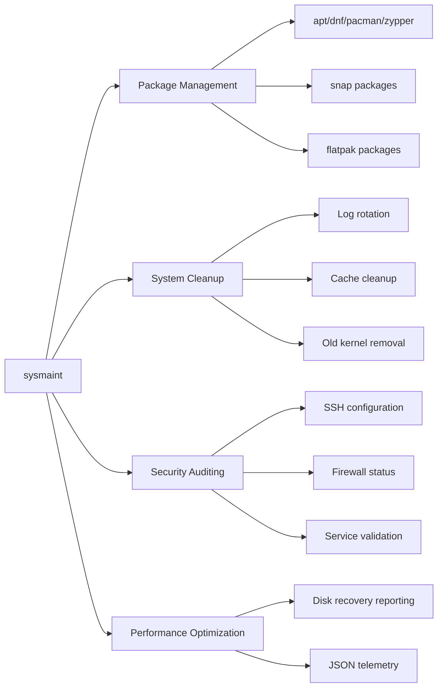

<div align="center">

# 🛠️ SYSMAINT

### Enterprise Linux System Maintenance — One Command, All Distros

[](https://github.com/Harery/SYSMAINT/releases/latest)
[](LICENSE)
[](https://ghcr.io/harery/sysmaint)
[](docs/TEST_QUICKSTART.md)
[](docs/TEST_MATRIX.md)
[](docs/TEST_SUMMARY.md)
[](docs/TEST_GUIDE.md)

[](https://github.com/Harery/SYSMAINT/stargazers)
[](https://github.com/Harery/SYSMAINT/network/members)

**Automated Package Updates • System Cleanup • Security Auditing • Performance Optimization**

Supports **Ubuntu, Debian, Fedora, RHEL, Rocky, Alma, CentOS, Arch, openSUSE**

</div>

---

## 📖 Table of Contents

- [Quick Start](#-quick-start)
- [Product Requirements](#-product-requirements)
- [Why SYSMAINT](#-why-sysmaint)
- [Features](#-features)
- [Platform Support](#-platform-support)
- [Installation](#-installation)
- [Usage](#-usage)
- [Automation](#-automation)
- [Documentation](#-documentation)
- [Quality Metrics](#-quality-metrics)
- [Contributing](#-contributing)
- [License](#-license)

---

## 🚀 Quick Start

```bash
# Clone the repository
git clone https://github.com/Harery/SYSMAINT.git
cd SYSMAINT

# Make executable
chmod +x sysmaint

# Preview changes (100% safe, read-only)
sudo ./sysmaint --dry-run

# Execute maintenance
sudo ./sysmaint
```

**Or use Docker:**
```bash
docker run --rm --privileged ghcr.io/harery/sysmaint:latest
```

---

## 📋 Product Requirements

The SYSMAINT product requirements document (PRD) defines the vision, requirements, and roadmap for the project.

**[📄 View Product Requirements (PRD)](docs/PRD.md)**

### Key Requirements

- **Multi-Distro Support** - Single tool supporting 9+ Linux distributions
- **Safe Operation** - Dry-run mode for previewing all changes
- **Audit Trail** - JSON output for compliance and monitoring
- **Automation Ready** - Systemd timers, cron jobs, Docker/Kubernetes support
- **Enterprise Grade** - Comprehensive testing (500+ tests), security scanning

---

## ✨ Why SYSMAINT?

Linux system maintenance is fragmented across distributions, each with different package managers, cleanup procedures, and security practices. SYSMAINT unifies这一切 into a single, production-ready tool.

| Feature | SYSMAINT | Traditional Scripts |
|:-------:|:--------:|:-------------------:|
| **9 Distros** | ✅ One tool | ❌ Multiple scripts |
| **Safety** | ✅ Dry-run mode | ❌ Risky execution |
| **Audit Trail** | ✅ JSON output | ❌ No logging |
| **Interactive** | ✅ TUI menu | ❌ CLI only |
| **Tests** | ✅ 500+ tests | ❌ None |
| **Speed** | ⚡ <3.5 min avg | 🐌 Variable |

---

## 📦 Features

### Core Capabilities



### What SYSMAINT Does

| Module | Description | Benefit |
|--------|-------------|---------|
| **Package Management** | Automated updates, upgrades, and cleanup | Keeps software current & secure |
| **System Cleanup** | Removes logs, caches, temp files, old kernels | Recovers disk space |
| **Security Auditing** | Checks permissions, services, and repos | Identifies vulnerabilities |
| **JSON Telemetry** | Structured output for monitoring | Enables automation |
| **Dry-Run Mode** | Preview all changes safely | Zero-risk testing |
| **Interactive TUI** | User-friendly dialog-based menu | Easy for beginners |

---

## 🌍 Platform Support

| Distribution | Versions | Package Manager | Status |
|--------------|----------|:---------------:|:------:|
| **Ubuntu** | 22.04, 24.04 | `apt` | ✅ LTS |
| **Debian** | 12, 13 | `apt` | ✅ Stable |
| **Fedora** | 41 | `dnf` | ✅ Latest |
| **RHEL** | 9, 10 | `dnf/yum` | ✅ Enterprise |
| **Rocky Linux** | 9, 10 | `dnf/yum` | ✅ Enterprise |
| **AlmaLinux** | 9, 10 | `dnf/yum` | ✅ Enterprise |
| **CentOS** | 9 Stream | `dnf/yum` | ✅ Stream |
| **Arch Linux** | Rolling | `pacman` | ✅ Tested |
| **openSUSE** | Tumbleweed | `zypper` | ✅ Tested |

---

## 📥 Installation

### Method 1: Git Clone (Recommended)

```bash
git clone https://github.com/Harery/SYSMAINT.git
cd SYSMAINT
chmod +x sysmaint
sudo ./sysmaint --dry-run
```

### Method 2: Direct Download

```bash
curl -O https://raw.githubusercontent.com/Harery/SYSMAINT/main/sysmaint
chmod +x sysmaint
sudo ./sysmaint --dry-run
```

### Method 3: Docker

```bash
docker pull ghcr.io/harery/sysmaint:latest
docker run --rm --privileged ghcr.io/harery/sysmaint:latest
```

**Available Docker Images:**
| Image | Description |
|-------|-------------|
| `ghcr.io/harery/sysmaint:latest` | Latest stable release |
| `ghcr.io/harery/sysmaint:v1.0.0` | Version pinned |
| `ghcr.io/harery/sysmaint:ubuntu` | Ubuntu-based variant |
| `ghcr.io/harery/sysmaint:debian` | Debian-based variant |
| `ghcr.io/harery/sysmaint:fedora` | Fedora-based variant |

**Multi-architecture:** `linux/amd64`, `linux/arm64`

> **🐳 Full Docker Guide:** [docs/DOCKER.md](docs/DOCKER.md)

### Method 4: System-Wide Installation

```bash
# Install to system path
sudo install -Dm755 sysmaint /usr/local/sbin/sysmaint

# Enable automated maintenance
sudo install -Dm644 packaging/systemd/sysmaint.{service,timer} /etc/systemd/system/
sudo systemctl enable --now sysmaint.timer
```

> **📖 Full Installation Guide:** [docs/INSTALLATION.md](docs/INSTALLATION.md)

---

## 💻 Usage

### Interactive Mode (Recommended for First-Time Users)

```bash
sudo ./sysmaint --gui
```

Launches an interactive terminal menu (TUI) for guided operation.

### Fully Automated Mode

```bash
sudo ./sysmaint --auto
```

Runs all maintenance operations without prompts.

### Specific Operations

```bash
# Package management only
sudo ./sysmaint --upgrade

# Cleanup only
sudo ./sysmaint --cleanup

# Remove old kernels
sudo ./sysmaint --purge-kernels

# Security audit only
sudo ./sysmaint --security-audit
```

### JSON Output for Automation

```bash
sudo ./sysmaint --json-summary | jq .
```

### Quiet Mode (for Cron)

```bash
sudo ./sysmaint --auto --quiet
```

### All Command-Line Options

| Option | Description |
|--------|-------------|
| `--dry-run` | Preview changes without executing |
| `--gui` | Interactive TUI menu |
| `--auto` | Non-interactive automated mode |
| `--upgrade` | Update all packages |
| `--cleanup` | Clean caches and temp files |
| `--purge-kernels` | Remove old kernel packages |
| `--security-audit` | Run security checks |
| `--json-summary` | Output results in JSON format |
| `--verbose` | Detailed logging output |
| `--quiet` | Minimal output only |

---

## 🤖 Automation

### Systemd Timer (Recommended)

```bash
# Install service files
sudo install -Dm755 sysmaint /usr/local/sbin/sysmaint
sudo install -Dm644 packaging/systemd/sysmaint.{service,timer} /etc/systemd/system/

# Enable weekly automatic maintenance
sudo systemctl enable --now sysmaint.timer

# Check status
sudo systemctl status sysmaint.timer
```

### Cron Job

```bash
# Edit crontab
crontab -e

# Add weekly maintenance (Sundays at 2 AM)
0 2 * * 0 /usr/local/sbin/sysmaint --auto --quiet
```

### Docker Compose

```yaml
services:
  sysmaint:
    image: ghcr.io/harery/sysmaint:latest
    privileged: true
    volumes:
      - /:/host:ro
    # Override command as needed
    # command: ["--auto", "--quiet"]
```

### Kubernetes CronJob

```yaml
apiVersion: batch/v1
kind: CronJob
metadata:
  name: sysmaint
spec:
  schedule: "0 2 * * 0"  # Weekly at 2 AM
  jobTemplate:
    spec:
      template:
        spec:
          containers:
          - name: sysmaint
            image: ghcr.io/harery/sysmaint:latest
            securityContext:
              privileged: true
          restartPolicy: OnFailure
```

---

## 📊 Quality Metrics

| Metric | Value | Status |
|--------|-------|:------:|
| **Test Coverage** | 500+ tests across 14 suites | ✅ |
| **Code Quality** | ShellCheck: 0 errors | ✅ |
| **Runtime** | <3.5 minutes average | ✅ |
| **Memory Usage** | <50 MB | ✅ |
| **Platform Support** | 9 distributions tested | ✅ |
| **Container Images** | Multi-arch (amd64/arm64) | ✅ |

---

## 🔒 Security

SYSMAINT is built with security-first principles:

- ✅ **Input Validation** — All parameters sanitized
- ✅ **Least Privilege** — Minimal sudo requirements
- ✅ **Audit Trail** — JSON output for compliance
- ✅ **No External Calls** — Zero network dependencies
- ✅ **ShellCheck Verified** — Static analysis passed
- ✅ **Vulnerability Scanning** — CI/CD integrated

> **🔐 Security Policy:** [docs/SECURITY.md](docs/SECURITY.md)

---

## 🧪 Testing

SYSMAINT includes **500+ tests** covering all supported Linux distributions with automated testing in both local Docker and GitHub Actions.

### Quick Test Commands

```bash
# Quick validation on current system
./tests/quick_test.sh

# Test specific OS in Docker
./tests/test_single_os.sh ubuntu 24.04

# Validate before PR submission
./tests/validate_pr.sh
```

### Test Coverage

| Category | Suites | Tests |
|----------|--------|-------|
| **Smoke Tests** | Basic functionality | 10+ |
| **OS Family** | Debian, RedHat, Arch, SUSE, Fedora, Cross-OS | 80+ |
| **Execution Modes** | --auto, --gui, --dry-run, --quiet, --verbose, --json | 20+ |
| **Features** | Packages, cleanup, security, firmware | 60+ |
| **Security** | Permissions, GPG, SELinux/AppArmor | 40+ |
| **Edge Cases** | Failures, network issues, permissions | 30+ |
| **Integration** | systemd, cron, Docker, services | 30+ |
| **Docker** | Container-specific tests | 40+ |
| **GitHub Actions** | CI/CD environment tests | 50+ |
| **Performance** | Benchmarks | 15+ |
| **TOTAL** | **14 Suites** | **500+** |

### Local Docker Testing

Test across all supported OS locally:

```bash
# Single OS
./tests/run_local_docker_tests.sh --os ubuntu-24

# Multiple OS (parallel)
./tests/run_local_docker_tests.sh --os ubuntu-24,debian-12,fedora-41 --parallel

# Full test suite
./tests/full_test.sh --profile full --parallel
```

### GitHub Actions CI/CD

- **Automatic**: Runs on every push and pull request
- **Matrix**: Tests all 14 OS versions in parallel
- **Fast**: Smoke tests complete in ~5 minutes per OS

```bash
# Trigger manual CI run
gh workflow run test-matrix.yml -f test_profile=smoke -f os_filter=ubuntu-24

# Download CI results
gh run download --name test-results-ubuntu-24
```

### Result Comparison

Compare local Docker vs GitHub Actions results to identify discrepancies:

```bash
# Run both and compare
./tests/run_dual_environment_tests.sh --os ubuntu --version 24.04

# Compare existing results
./tests/report_discrepancies.sh --results tests/results
```

**Metrics:**
- **Pass Rate**: Tests passed percentage
- **Congruence**: Environment similarity (0-100%)
- **Accuracy Score**: Overall consistency measure

### Test Documentation

| Document | Description |
|----------|-------------|
| **[Test Dashboard](tests/test-dashboard.html)** | Interactive test results visualization |
| **[Test Quick Start](docs/TEST_QUICKSTART.md)** | Get started in 5 minutes |
| **[Test Guide](docs/TEST_GUIDE.md)** | Comprehensive testing guide |
| **[Test Cheatsheet](docs/TEST_CHEATSHEET.md)** | Quick command reference |
| **[Test Matrix](docs/TEST_MATRIX.md)** | Complete 500+ test inventory |
| **[Test Summary](docs/TEST_SUMMARY.md)** | Infrastructure overview |
| **[Test Architecture](docs/TEST_ARCHITECTURE.md)** | Test structure & design |
| **[Test Troubleshooting](docs/TEST_TROUBLESHOOTING.md)** | Common issues & solutions |
| **[Contributing Tests](docs/CONTRIBUTING_TESTS.md)** | Contribution guide |
| **[OS Support](docs/OS_SUPPORT.md)** | OS compatibility matrix |
| **[Performance Baselines](tests/PERFORMANCE_BASELINES.md)** | Performance targets & metrics |
| **[Status Assessment](tests/STATUS_ASSESSMENT.md)** | Project completion status |
| **[Executive Summary](docs/EXECUTIVE_SUMMARY.md)** | Executive overview |

---

## 📖 Documentation

| Document | Description |
|----------|-------------|
| **[Product Requirements (PRD)](docs/PRD.md)** | Product vision, requirements & roadmap |
| **[Project Structure](docs/PROJECT_STRUCTURE.md)** | Directory organization & file layout |
| **[Library Modules](lib/README.md)** | Core library documentation |
| **[Utility Scripts](scripts/README.md)** | Development & CI/CD scripts |
| **[Installation Guide](docs/INSTALLATION.md)** | All installation methods |
| **[Troubleshooting](docs/TROUBLESHOOTING.md)** | Common issues & solutions |
| **[Architecture](docs/ARCHITECTURE.md)** | System design & components |
| **[Performance](docs/PERFORMANCE.md)** | Benchmarks by OS |
| **[Security](docs/SECURITY.md)** | Security policy & best practices |
| **[Contributing](docs/CONTRIBUTING.md)** | Development guidelines |
| **[Code of Conduct](docs/CODE_OF_CONDUCT.md)** | Community guidelines |

---

## 🤝 Contributing

We welcome contributions from the community! Please see our contributing guidelines:

- **[Contributing Guide](docs/CONTRIBUTING.md)** — Development workflow & standards
- **[Code of Conduct](docs/CODE_OF_CONDUCT.md)** — Community guidelines

---

## 📜 License

MIT © 2025 [Mohamed Elharery](https://www.harery.com)

> **Permission is hereby granted, free of charge, to any person obtaining a copy of this software and associated documentation files (the "Software"), to deal in the Software without restriction, including without limitation the rights to use, copy, modify, merge, publish, distribute, sublicense, and/or sell copies of the Software, and to permit persons to whom the Software is furnished to do so, subject to the following conditions:**
>
> **The above copyright notice and this permission notice shall be included in all copies or substantial portions of the Software.**

---

## ⭐ Star History

[]


**If you find SYSMAINT useful, please consider giving it a star! ⭐**

---

## 🔗 Quick Links

| Resource | Link |
|----------|------|
| **Website** | https://www.harery.com |
| **Repository** | https://github.com/Harery/SYSMAINT |
| **Documentation** | https://github.com/Harery/SYSMAINT/tree/main/docs |
| **Issue Tracker** | https://github.com/Harery/SYSMAINT/issues |
| **Discussions** | https://github.com/Harery/SYSMAINT/discussions |
| **Releases** | https://github.com/Harery/SYSMAINT/releases |
| **Docker Image** | https://ghcr.io/harery/sysmaint |

---

<div align="center">

**Built with ❤️ for the Linux ecosystem**

*[GitHub](https://github.com/Harery/SYSMAINT) • [Documentation](docs/) • [Support](https://github.com/Harery/SYSMAINT/issues) • [Discussions](https://github.com/Harery/SYSMAINT/discussions)*

</div>
